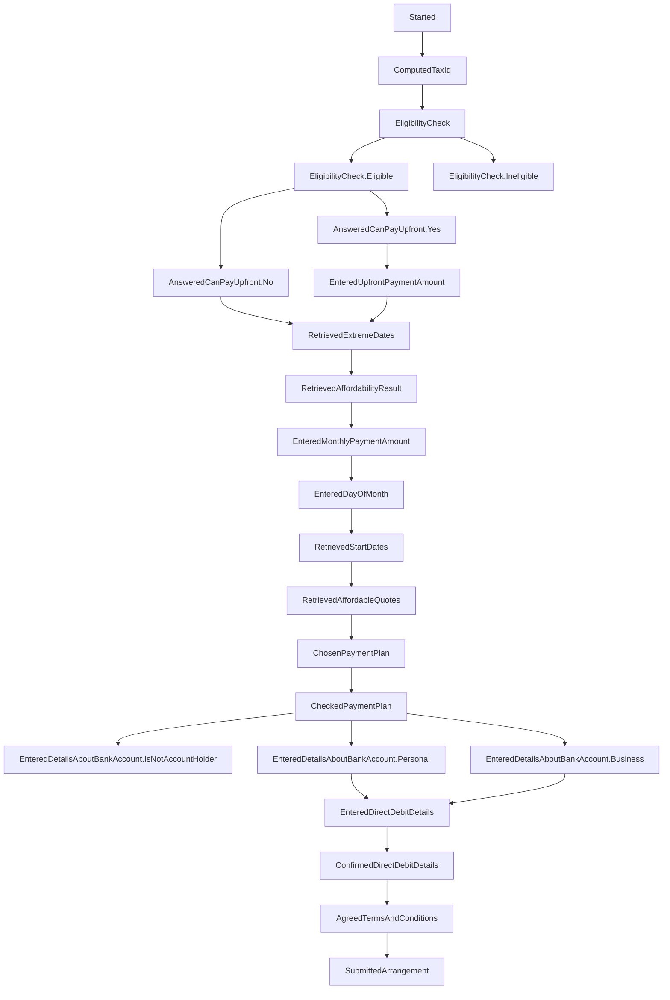

# essttp-backend

This repository contains the backend microservice for eSSTTP (Enhanced Self Service Time To Pay). 
It is built using Scala (2.12) and the Play framework (2.8). We use linting tools such as WartRemover and Sclariform. 
This microservice acts as a state machine, utilising mongodb. 
As users progress through the [frontend](https://www.github.com/hmrc/essttp-frontend) journey various rest endpoints are called to update the state of the users journey. 
This project makes use of sbt modules - which act as libraries for our models and anything else we may want to reuse in the frontend. We have coined the term `cor` for these modules - `collection of routines`

---

## Contents

* [Dictionary](https://www.github.com/hmrc/essttp-backend#dictionary)
* [Diagram of flow state](https://www.github.com/hmrc/essttp-backend#diagram-of-flow-state)
* [Running the service locally](https://github.com/hmrc/essttp-backend#running-locally)
* [Running tests](https://github.com/hmrc/essttp-backend#running-tests)
* [Developing locally](https://github.com/hmrc/essttp-backend#developing-locally)
* [Examples of requests](https://github.com/hmrc/essttp-backend#examples-of-requests)

---

### Dictionary
Acronyms used in a codebase. To speed up writing and reading. 

| Phrase | Description|
|--------| ------- |
| Sj     | Start Journey |
| Bta    | Business Tax Account - client app|
| Epaye  | Employers' Pay as you earn - tax type|

---

### Diagram of flow state

To edit this, use [mermaid live editor](https://mermaid.live/)

[Stages in code base](https://github.com/hmrc/essttp-backend/blob/main/cor-journey/src/main/scala/essttp/journey/model/Stage.scala)

---

### Running locally

You can run the service locally using sbt: `sbt run`

If running locally, the service runs on port `9216`

---

### Running tests

You can run the unit/integration tests locally using sbt: sbt test

To run a specific spec, run `sbt 'testOnly *<SpecName>'`, e.g. `sbt 'testOnly *JourneyControllerSpec'`

---

### Developing locally
If you want to make changes to one of the cors and test those changes locally before raising a pull request, you can publish your changes locally.

To do this, simply run
```
sbt publishLocal
``` 
to create a snapshot version of backend locally (e.g. `1.10.0-SNAPSHOT`) then use that as the cor version in frontend.

---

### Examples of requests

There are examples of http requests [here](https://github.com/hmrc/essttp-backend/tree/main/http-requests)

---

### License

This code is open source software licensed under the [Apache 2.0 License]("http://www.apache.org/licenses/LICENSE-2.0.html").