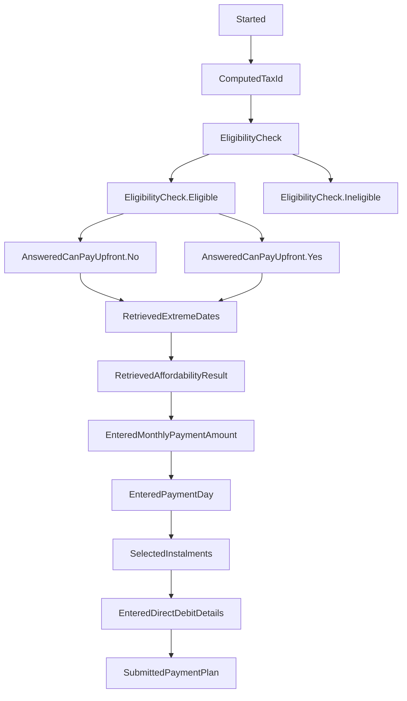

# essttp-backend


## Dictionary
Acronyms used in a codebase. To speed up writing and reading. 

| Phrase | Description|
|--------| ------- |
| Sj     | Start Journey |
| Bta    | Business Tax Account - client app|
| Epaye  | Employers' Pay as you earn - tax type|


### General flow

To edit this, use [mermaid live editor](https://mermaid.live/)

[Stages in code base](https://github.com/hmrc/essttp-backend/blob/main/cor-journey/src/main/scala/essttp/journey/model/Stage.scala)

### Developing locally and using changes in frontend
Hint: run 
```
sbt publishLocal
``` 
to create a snapshot version of backend locally (e.g. `1.10.0-SNAPSHOT`) then use that as the cor version in frontend.

### License

This code is open source software licensed under the [Apache 2.0 License]("http://www.apache.org/licenses/LICENSE-2.0.html").